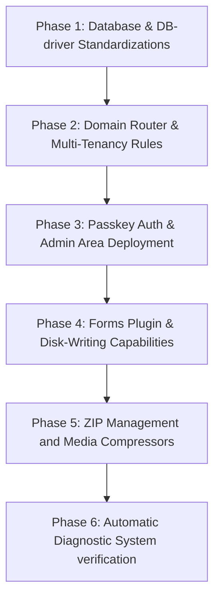

# Implementation Plan: Multi-Stack Feature Equivalence Upgrade
This document outlines the engineering plan to upgrade **repo-react**, **repo-vue**, **repo-python**, and **repo-go** to achieve complete feature parity with the reference implementation in **repo-php**.

Achieving functional equivalence across all active programming stacks is essential to ensure consistent benchmarking, uniform evaluation (AX - AI Agent Experience), and reliable deployment validation across the multi-tenant architecture.

---

## 🎯 1. Reference Architecture: Core Features of `repo-php`

To build identical capabilities in other stacks, we must first map out the exact functional modules currently live in the `/repo-php/` workspace:

| Core Module | File References | Description |
| :--- | :--- | :--- |
| **Class Autoloading** | `public/index.php` | Lazily loads class definitions from the `/class` directory without manual includes. |
| **Dynamic Multi-Tenant Router** | `class/Router.php` | Intercepts HTTP requests, resolves tenant from `HTTP_HOST` headers (supports custom overrides via `ACTIVE_SITE_OVERRIDE` or query parameter `?__site`), isolates executing directories via `chdir($siteDir)`, and serves proper pages. |
| **Built-in System Diagnostics** | `class/CMS.php` | Returns detailed JSON diagnostic logs containing write permissions, PHP environment variables, and active modules when triggering `?cms_debug=true`. |
| **Secure Admin Interface** | `class/AdminRouter.php` | Admin workspace at `/admin` secured via environment key `APP_ADMIN_PASSKEY` (checking cookie or `X-Admin-Passkey` headers). |
| **Zero-Node-Build Admin UI** | `class/AdminRouter.php` | SPA admin application utilizing CDN-loaded Vue 3 and browser-native ES Modules (dynamic imports) to avoid build tooling dependencies. |
| **Dynamic Form Builder Plugin** | `plugins/forms/`, `public/js/` | Intercepts dynamic forms configuration (`forms.json`), records contact details / user submissions, and displays them inside the Vue client. |
| **Inline Media Wrapping (Zip)**| `class/Router.php`, `plugins/` | Extracts on-the-fly and serves image binaries wrapped inside `.zip` formats to ensure Git-friendly binary transfers. |
| **ZIP Site Portability (Backups)**| `class/AdminRouter.php` | Dynamic compression of the user site workspace down to attachment streams (`download`) and full extraction uploads (`import`) to easily overwrite templates on the fly. |
| **SQLite / PostgreSQL Persistence**| `class/DB.php` | A driver-agnostic model wrapper capable of swapping between localized SQLite state and managed PostgreSQL configurations dynamically. |
| **AI Tasks Queue & Scheduler** | `class/Scheduler.php` | Controls scheduling cronjobs, running tasks queue dynamically, and hooking up background routines to the standard `/api/heartbeat`. |

---

## 🛠️ 2. Upgrade Plans by Technology Stack

To support these file-manipulation, dynamic-routing, and administrative features in other repos, we must transform them into robust backend-backed applications.

---

### A. React & Vue Upgrades (`repo-react` & `repo-vue`)
Currently, `repo-react` and `repo-vue` are implemented as client-side-only Single Page Applications (SPAs). To achieve full feature parity, we must introduce a local **Express Node server** for each ecosystem.

#### 1. Directory Structure Additions
```text
/repo-react-or-vue
├── public/                 # Built client assets (Vite output)
├── server/                 # Express backend layer
│   ├── config/             # DB & Passkey config
│   ├── controllers/        # Forms, Sites, and AI task handlers
│   ├── db/                 # SQLite integration (better-sqlite3)
│   ├── middleware/         # Auth verification (APP_ADMIN_PASSKEY)
│   └── index.js            # Express Entrypoint & Static Router
├── src/                    # Existing SPA files
├── sites/                  # Multi-tenant Flat-File datasets (identical to content/)
│   ├── site1.com/index.html
│   └── site2.com/index.html
└── package.json            # Dev/Server scripts & packages
```

#### 2. Technical Implementation Specifications

*   **Dynamic Domain & Tenant Routing**:
    *   The Node backend listens on port `3000`.
    *   Incoming request headers are scanned to extract the `Host` value.
    *   The router resolves the hostname against standard configs (or URL parameter rules). If matched, it reads the static content files from `/sites/{site_domain}` and serves them directly.
    *   If no match occurs, it resolves to `site1.com`.
*   **Secure Administration (`/admin`, `/api/admin/*`)**:
    *   Introduce an admin router served on `/admin` rendering the exact same CDN Vue 3 Plain JS components or integrating them inside React/Vue routes.
    *   Authorize REST targets via Express middleware checking `req.cookies.admin_passkey` or `req.headers['x-admin-passkey']` against local environment variables.
*   **Dynamic ZIP Import & Export**:
    *   Use the `adm-zip` NPM library.
    *   Create `GET /api/admin/sites/:site/download` to compress and stream site directories on-the-fly.
    *   Create `POST /api/admin/sites/:site/upload` using `multer` to accept zipped payloads and extract them directly into `/sites/`, overwriting resources dynamically.
*   **Forms Plugin**:
    *   Integrate a SQLite database (`better-sqlite3`) inside `/server/db/`.
    *   Endpoints handle saving visual forms configuration schemas to `/sites/{domain}/forms.json` and recording dynamic JSON submissions into a local DB table.
*   **Media Wrappers & Generation**:
    *   On-the-fly zip compression and extraction of image requests inside the Express router.
    *   Serve dynamic fallback SVGs whenever image assets are marked plain or are missing on disk.

---

### B. Python Upgrades (`repo-python`)
`repo-python` uses FastAPI, which provides an exceptionally clean foundation for file manipulation and class structures.

#### 1. Directory Structure Additions
```text
/repo-python
├── app/
│   ├── class_loaders/      # Python modules mimicking PHP core autoloader
│   │   ├── cms.py
│   │   └── router.py
│   ├── main.py             # Dedicated FastAPI server
│   ├── database.py         # SQLAlchemy SQLite and PostgreSQL drivers
│   ├── admin.py            # Passkey verified route endpoints
│   ├── forms_manager.py    # Form plugin actions
│   └── scheduler.py        # Background task scheduler and queue
├── content/                # Multi-tenant Flat-File directories
│   ├── site1.com/site.html # Tenant index views
│   └── config.py           # Domain configuration dictionary
├── static/                 # CSS/JS resources
└── templates/              # Jinja2 template wrappers
```

#### 2. Technical Implementation Specifications

*   **Dynamic Router (Multitenancy)**:
    *   A FastAPI middleware extracts the hostname from the Request header (`host.split(":")[0]`).
    *   Supports dynamic directory mappings. If `query_params.get("__site")` or `ACTIVE_SITE_OVERRIDE` is active, it forces context override.
    *   Isolates file references. While Python doesn't rely on global directory changing (`os.chdir`) as heavily as PHP, the router resolves local relative paths relative to the specific tenant path under `/content/`.
*   **ZIP Packaging System**:
    *   Utilize Python's standard `shutil` and `zipfile` modules.
    *   `FastAPI.responses.StreamingResponse` buffers the binary archive and streams it down to user downloads.
    *   Saves multipart files, extracts them, and overrides existing flat-files cleanly.
*   **Admin Panel and Passkey Authorization**:
    *   Endpoints under `/admin` verified using FastAPI security dependencies (validating headers or HTTP cookies against `APP_ADMIN_PASSKEY`).
    *   Standard Vue 3 JS scripts served over static mappings to present the identical administrative layout.
*   **Dynamic Forms & db.py Pipeline**:
    *   Integrate SQLite and PostgreSQL support using modern database connections (SQLAlchemy or SQLModel).
    *   A database migrator runs at boot, translating dialect configurations and preparing table models for AI tasks and contact inputs.
*   **Media Wrap Extraction**:
    *   FastAPI interceptor endpoint captures requests for image formats (`.jpg`, `.png`, and `.svg`).
    *   If a `.zip` alternative exists in the static folder, it extracts it dynamically inside Python memory buffers and yields standard `StreamingResponse(content, media_type)`.

---

### C. Go Upgrades (`repo-go`)
`repo-go` requires building a high-speed, compiled server capable of processing binary buffers, dynamic zips, and database operations.

#### 1. Directory Structure Additions
```text
/repo-go
├── main.go                 # Server execution, mapping, and HTTP init
├── pkg/
│   ├── cms/                # Go translation of PHP CMS diagnostics
│   ├── router/             # Domain routing engine & path isolated overrides
│   ├── admin/              # Credentials checks & Web interfaces
│   ├── db/                 # SQL database models (SQLite & PostgreSQL integrations)
│   ├── forms/              # Dynamic forms tracking components
│   └── scheduler/          # Task queue scheduling workers
├── content/                # Tenancy directory tree (identical to PHP)
│   └── site1.com/index.html
└── go.mod                  # Modules config (e.g. github.com/mattn/go-sqlite3)
```

#### 2. Technical Implementation Specifications

*   **Dynamic Multiplexing Router**:
    *   Leverages the native `net/http` multiplexer or high-performance `Gin` routing framework.
    *   Intercepts HTTP requests, parses the Host name, and translates relative queries directly into the tenant folder.
    *   Includes full-featured fallback setups targeting `site1.com`.
*   **ZIP Archive Management**:
    *   Utilizes the standard library `archive/zip` and `io` pipelines to create zipped archives in-memory.
    *   Dynamic zip unpacking of user upload bodies, overwriting standard site folders.
*   **Passkey Verification Middleware**:
    *   Custom HTTP middleware asserting that `X-Admin-Passkey` or `admin_passkey` cookie equals the system standard `APP_ADMIN_PASSKEY`.
    *   Provides standard CORS rules matching the Node and PHP backends.
*   **Forms Plugin**:
    *   Uses a simple DB layout utilizing SQLite or PostgreSQL connections (e.g. via `gorm.io/gorm`).
    *   Dumps localized inputs and allows exporting files efficiently as JSON representations.
*   **Media Compression Engine**:
    *   Unzips graphic files on execution if standard files are missing.
    *   Serves identical mock SVGs containing custom warning parameters.

---

## 📈 3. Benchmarking & Agentic AI AX Evaluation Matrix

Standardizing these configurations allows benchmarking how different backend languages process matching administrative tasks.

### Metric Definitions for Evaluating AI Agents (AX)
*   **Refinement Velocity**: Seconds taken by an AI agent to locate, edit, and safely save a targeted HTML node or backend API endpoint.
*   **System Integrity Preservation**: The percentage of times an AI successfully completes a task without breaking existing routing logic or configuration keys.
*   **Memory Footprint & Startup Efficiency**: Resource consumption under matched heavy concurrency benchmarks.

---

## 🔄 4. Implementation Phase Order



*This master upgrade plan provides detailed architectural routes for all future AI coding agents to establish exact feature parity across the universal benchmark.*
