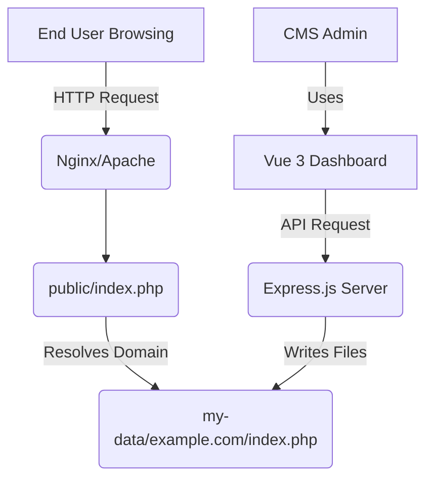

# PHP CMS Architecture

This project features a multi-tenant, flat-file PHP CMS alongside a Vue 3/Express.js dashboard that acts as the management interface. This document explains the architecture of the PHP side of the CMS.

## Directory Structure

The PHP runtime is encapsulated in the `/repo-php` directory:

```text
/repo-php
├── public/                 # Web root for the PHP application
│   ├── css/
│   ├── js/
│   └── index.php           # The Front Controller / Router
├── content/                # Default storage directory for sites (bundled)
│   ├── config.php.example
│   ├── site1.com/          # Folder matching the host/domain name
│   │   └── index.php       # The site's specific template/entry point
│   └── site2.com/
│       └── index.php
├── my-data/                # (Optional) Persistent storage mount path
├── Dockerfile              # Container definition for the PHP app
└── nginx.conf              # Nginx configuration for serving the PHP app
```

## The Router (`public/index.php`)

All incoming requests to the front-facing website hit `/repo-php/public/index.php`. This acts as a global front controller that routes traffic to the correct site folder based on the domain (`$_SERVER['HTTP_HOST']`).

### Resolution Logic
1. **Environment Override:** It first checks if `ACTIVE_SITE_OVERRIDE` is set. This is useful for testing or forced deployments.
2. **Configuration Map:** It looks for `config.php` in the content directory. If present, it checks if there is a specific mapping for the incoming `HTTP_HOST`. This allows you to map custom domains (e.g., `www.mycustomdomain.com` -> `site1.com`).
3. **Domain Name Matching:** If there's no override or explicit mapping, it sanitizes the `HTTP_HOST` string and looks for a folder that exactly matches it.
4. **Fallback:** If the target directory does not exist, it automatically falls back to serving `site1.com` to prevent fatal application errors.

### Execution
Once the directory is resolved, the router:
1. Sets the current working directory to the target site's folder (`chdir($siteDir)`). This is a critical feature because it allows site developers to use simplified relative paths (like `include 'header.php'`) within their local site folder.
2. Performs a `require_once 'index.php'` to hand off execution directly to that specific tenant. 

## Storage: `content/` vs `my-data/`

The CMS is designed to be stateless in its implementation, but stateful in its data bindings. 

- **`/repo-php/content/`**: This ships with the initial boilerplate templates and demo sites (`site1.com`, `test.com`, etc.). It acts as the fallback.
- **`/repo-php/my-data/`**: In production (or via Docker volumes), dynamic file storage can be mounted to `my-data`. This prevents container restarts from destroying user edits made via the CMS interface.

The router first checks if `my-data` exists. If not, it falls back to `content`.

## Site Internal Structure

Each site directory (e.g., `/repo-php/content/mysite.com/`) typically follows a standard PHP templating structure:

```text
mysite.com/
├── index.php           # The main entry point for the site
├── header.php          # Shared header template
├── footer.php          # Shared footer template
├── sidebar.php         # (Optional) Shared sidebar
├── img/                # Media directory
│   ├── logo.png.zip    # AI-generated image wrapper
│   └── hero.jpg.zip
└── css/                # Site-specific styles
    └── style.css
```

### Key Principles:
- **Relative Inclusion:** Since the Router changes the working directory to the site folder, you can use `include 'header.php';` without needing absolute paths.
- **Media Wrappers:** Images are stored as `.zip` files (e.g., `hero.jpg.zip`) to ensure cross-platform binary compatibility and Git synchronization. The PHP Router automatically extracts these on-the-fly.

## ZIP Import & Export (Backup/Migrate)

The CMS now provides built-in tools to download and upload entire site contexts as ZIP archives.

### Export (Download)
- Users can download a full site folder as a `.zip` file from the Dashboard.
- This creates a portable snapshot of the site's code, templates, and current media wrappers.

### Import (Upload)
- Users can upload a `.zip` file to an existing site slot.
- **Warning:** Uploading a ZIP will overwrite existing files in that site directory.
- This is the preferred method for migrating a site from a local development environment into the CMS or for restoring from a backup.

## CMS Management (Vue + Express) Integration

The Node.js (Express) backend serves as the active CMS manager for the PHP application. The frontend allows users to effectively bypass FTP and database storage by providing visual file-editing directly into the content directory.

When the Vue frontend interacts with the API (`/api/sites/` and `/api/sites/:site/files`), the Node server directly updates the PHP files located in `/repo-php/content/` or `/repo-php/my-data/`. 



This hybrid approach allows lightning-fast execution of PHP views utilizing traditional file structures, whilst retaining the modern componentized UI of a headless CMS.
